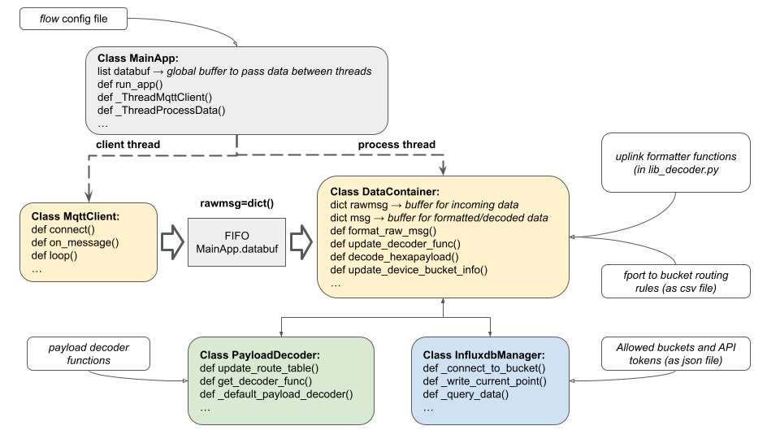
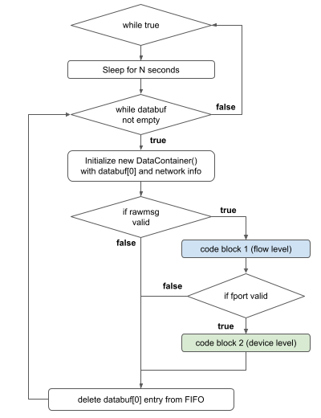

# Documentation Dataflux

## General Principles

For each running instance of *dataflux.py* , a connection - named *flow* - is created between a specified pool of devices inside a LoRa network (data source) and some buckets inside an Influxdb v2 database. Typical sources are *integration* features offered by the LoRa servers. 

List of currently supported server:

> - TTN over MQTT protocol
> - Orange over MQTT protocol
> - Chirpstack over MQTT protocol
> - Local files (manual upload of csv or json files)

The *dataflux.py* is made to be run in command line and requires a *flow* configuration file as argument.

```bash
usage: dataflux.py [-h] [--flow FLOW] [--delayloop DELAYLOOP]

Dataflux - Manage dataflow from LoRa server to Influxdb database

optional arguments:
  -h, --help            show this help message and exit
  --flow FLOW           specify flow file path (.json)
  --delayloop DELAYLOOP fix the wake up delay (sec) of the process thread
```

A *flow* file should contains all info on server, protocols, buckets, topics, ... that will be used to initialize the application and ensure its consistency between operations during the execution. Below is an example of a *flow* file that will connect a TTN application to the Influxdb database over MQTT.

```json
{
    "nwk_type": "ttn",
    "protocol": "mqtt",
    "client_id": "myttnappname",
    "influx_bucket": "mybucket",
    "influx_meas": "received",
    "server": "eu1.cloud.thethings.network",
    "port": 1883,
    "username": "myttnappname@ttn",
    "apikey": "MYAPIKEY",
    "topic": "v3/myttnappname/devices/+/up",
    "use_tls": false
}    
```

| Field         | Possible values                                                                                                                                                      | Type      |
| ------------- | -------------------------------------------------------------------------------------------------------------------------------------------------------------------- | --------- |
| nwk_type      | "ttn" or "orange" or "chirpstack" or "generic"                                                                                                                       | Mandatory |
| protocol      | "mqtt" or "http" or "ssh" or "manual"                                                                                                                                | Mandatory |
| client_id     | Any string. It is the *flow* identifier and will be used to tag influxdb entries.                                                                                    | Mandatory |
| influx_bucket | Any existing bucket name. Recommended: "iot-networks"                                                                                                                | Mandatory |
| influx_meas   | Any string but this is the 1st level of data filtering inside Influxdb. Recommended: "received" if its an automatic *flow* "uploaded" if it a manual data injection. | Mandatory |
| [*Others*]    | Will depend on the server and on the protocol.                                                                                                                       | Optional  |

Main functionalities are divided into independent threads. For compatibility issues, threads are generated with native python package *threading* (Python version >= 3.7) and use python package *queue* for shared resources and buffers. It also use python *logging* package as well as *try / except* blocks to manage program logs and execution errors.

The whole application is based around several custom Python classes that implement all target features. Classes and method definitions are found in folder *dataflux/lib/*.

| Main custom classes | Constructor                                                                                                                                                               | Description                                                                                            |
| ------------------- | ------------------------------------------------------------------------------------------------------------------------------------------------------------------------- | ------------------------------------------------------------------------------------------------------ |
| MainApp()           | `__init__(self, nwkinfo)`                                                                                                                                                 | Used to start/stop a *flow*. Here we define the main sequences for the *client* and *process* threads. |
| DataContainer()     | `__init__(self, rawmsg, client_id, nwk_type, bypass_decoder=False)`                                                                                                       | Custom container used to standardize data formats and processing functions all along the execution.    |
| MqttClient()        | `__init__(self, server, port, apikey, username="undef", topic='#',client_id="", nwk_type='undef',clean_session=True, userdata=None, use_tls=False,protocol=mqtt.MQTTv31)` | A custom MQTT client that inherits from the client class in package *paho-mqtt*                        |
| PayloadDecoder()    | `__init__(self, allowed_fport_range=[1,233])`                                                                                                                             | An object used to select the right decoder according to "FPort" values and process the hexa paylaod.   |
| InfluxdbManager()   | `__init__(self)`                                                                                                                                                          | An object used to handle the communication (connect/read/write) with the Influxdb database             |
|                     |                                                                                                                                                                           |                                                                                                        |

## Program Overview

> Warning: The python list *MainApp.databuf*, representing the global FIFO and mentionned in figures below, has been replaced by a python queue called *MainApp.queue*. Figures are out-of-date !

### Main application

The *MainApp()* instance starts two parallel threads:

1. One for the client that is continuously reading raw messages from a LoRa server and store them in the local FIFO (*MainApp.queue* of type *list*). It's here that we instantiate the *MqttClient()* object that will subscribe to the LoRa server *integration*. The client thread and the client class used are dependent to the protocol involved (MQTT, HTTP, SSH, ...)

2. An other thread that will periodically read the local FIFO and process the data using a *DataContainer()* object before sending it to the proper Influxdb buckets. This thread is common to any type of client, same main sequence is applied. The *DataContainer()* object will configure it-self using network info passed in the *flow* configuration file.

The Figure below illustrates the *dataflux* architecture for a case where we connect a MQTT integration on a LoRa server to an Influxdb database (i.e. TTN or Orange).



*Figure. Diagram of dataflux architecture*

### External files

In addition to the *flow* file necessarily passed as arguments when running the `python dataflux.py --flow`command, two other external files are needed by the program and internally loaded during its initialization steps.

File: *fport_routing_table.csv*

A csv file to declare new rules to link specific FPort values to specific combinations of Influxdb bucket and measurement names. Below is an example of a correct syntax for the fport routing table.

```csv
fport,bucket,measurement
12,iot-devices,histo
128,iot-devices-dev,test-station
233,iot-devices-dev,dummy
```

File: *influxdb_authbuckets.json*

A json file to declare bucket names and associated token (API keys) that will be used by the dataflux.py instances. Below is an example of a correct syntax for the declaration of authenticated buckets.

```json
{
    "iot-networks-dev":"rngONN-A... r0RznMhg==",
    "iot-devices-dev":"PrH9IFX3 ... tNlvWyrog=="
}
```

## Automated Data Processing

### Inside the client thread

The implementation of the client thread will depend on the protocol used. However, such threads must always store new raw message as a Python dictionaries at the end of the FIFO (*MainApp.queue*). Almost no formatting should be done here, except for the conversion to *dict* type.

### Inside the process thread

The process thread starts by initializing a PayloadDecoder() and a InfluxdbManager() instances. Then it goes into an infinite loop that sleeps for *N* seconds and then wake-up to check if there is new data in the local FIFO (*MainApp.queue*). If there is indeed new data, it will process and save it message per message, if not it loops again and goes back to sleep.

The Figure and code-like texts that follow illustrate the process thread operation and algorithms for the *code block 1 (flow level)* and the *code block 2 (devices level)*. 

| Some definitions for the following Python code snippets                              |
| ------------------------------------------------------------------------------------ |
| **self** refers to the top-object and is from custom class *MainApp()* in lib_app.py |
| **data** is from custom class *DataContainer()* in lib_client.py                     |
| **decoder_manager** is from custom class *PayloadDecoder()* in lib_decoder.py        |
| **influxdb_manager** is from custom class *InfluxdbManager()* in lib_influxdb.py     |



*Figure. Diagram of MainApp process thread*

#### Step 1 : flow level

> **Condition to execute Step 1**
> 
> "If raw message valid" = "Raw message in DataContainer() is of type *dict*"

If the raw message returned by the client thread and loaded in the new *DataContainer()* is checked valid (*data.rawmsg*) :

1. We first parse the raw message and load fields values into the final formatted message (*data.msg*). This is done by using functions called *uplink  fomatter* that are automatically selected by using the network info passed to the app (field *nwk_type*). These functions are specific to the network we use as a source (TTN, Orange, ...) and a new *uplink fomatter* should be written for any new server.

2. Then, we update the *flow*'s bucket info - sometimes also named client's bucket - and finally write the formatted message (*data.msg*) to the Influxdb database with proper Influxdb tags.

```python
# code block 1 : flow level
data.format_raw_msg()
data.print_msg()
data.update_client_bucket_info(self.nwkinfo['influx_bucket'], self.nwkinfo['influx_meas'])
data.print_info()
influxdb_manager.write_data_container_to_client_bucket(data)
```

See section *Data Format* below for more info on *uplink formatter*.

#### Step 2 : device level

During step 1, the *uplink formatter* should have updated the "fport" value and "payload" field (hexadecimal strings) of the formatted message *data.msg*.

> **Condition to execute Step 2**
> 
> "If message fport valid" =  "fport in allowed range (1 to 233)" and "a rules exists in the fport to bucket routing table"

In this step, based on the "fport" value read:

1. We first interrogate the PayloadManager() to return the correct decoding function and update the DataContainer() accordingly.

2. We use the previously loaded decoder to extract fields names and values encoded in the hexadecimal payload. If the payload is not valid (i.e. not of string type and length < 1 byte), nothing is done here.

3. We update the *device*'s bucket info according to rules found in the *fport to bucket routing table*. And then, we write the final version of the formatted message (*data.msg*) to the Influxdb database with proper Influxdb tags.

```python
# code block 2 : device level 
msg_fport = data.get_msg_fport()
data.update_decoder_func(decoder_manager.get_decoder_func(msg_fport))
data.decode_hexapayload()
data.print_msg()
data.update_device_bucket_info()
data.print_info()
influxdb_manager.write_data_container_to_device_bucket(data)
```

See section *Data Format* below for more info on *payload decoders* and *fport routing rules*.

## Data Format

### Raw messages

*On the client thread side ...*

To keep the custom class for MQTT (or HTTP, SSH, ...) clients as generic as possible we want to avoid any sort of formatting at this stage. As mentioned before, **inside the client threads, new messages should be append to the local FIFO as Python dictionaries** and the metadata associated to the MQTT (or HTTP, SSH, ...) transfer discarded.

> **Example**
> 
> With our custom class *MqttClient()* that inherits from the Python package *paho-mqtt* ( [github of paho-mqtt for python](https://github.com/eclipse/paho.mqtt.python)), the initial message as it was on the LoRa server (json format), is retrieved inside the *on_message* callback function as variable of type *bytes* (in *msg.paylaod*), to be then parsed with the *json* Python packages. 
> 
> The code below is an example of a *on_message* function of a *paho-mqtt* client that would return and append correct raw messages. keyword *self* refers to the top-object of class *MainApp()* and *self.queue* is the local FIFO.
> 
> *Warning: Here, the variable "msg" and its payload "msg.payload" refers to the MQTT payload, which is typically composed of the meta-data fields added by the LoRA server and of the actual LoRa payload.*

```python
def on_message_mqtt_client(client, userdata, msg):
    print(client.client_id,': new message on topic', msg.topic)
    print(type(msg.payload), (msg.payload))
    self.queue.put(json.loads(msg.payload))
```

### Formatted messages

*On the process thread side ...*

These messages are the final type of message that are built to be written into the Influxdb buckets. Such messages, also from *dict* type, are initialized and manipulated inside a *DataContainer()* object and referred as *self.msg* inside the container.

As pictured earlier, going from raw messages to final formatted messages require several data transformations:

1. During the creation of the *DataContainer()*, the variable *self.msg* is initialized with the predefined mandatory keys and their default values (see table below). Those fields are always present in the final message.

2. By calling `DataContainer.format_raw_msg()` , we use  an *uplink formatter* function to update mandatory fields and/or create new fields for the formatted message (*self.msg*) according to data extracted from the raw message (*self.rawmsg*). The typical data we extract at this stage are the meta-data and the payload in base64 or hexadecimal formats.

3. By calling `DataContainer.decode_hexapayload()` , we use a *payload decoder* function to parse the hexadecimal payload we got at step 2 (in *self.msg.payload*) and create new fields for the formatted message (*self.msg*) with end-device data read from the payload.

| Key    | Type | default val. | Key        | Type  | default val. |
| ------ | ---- | ------------ | ---------- | ----- | ------------ |
| devid  | str  | ""           | timestamp  | str   | ""           |
| deveui | str  | ""           | rssi       | float | 0.0          |
| devadd | str  | ""           | snr        | float | 0.0          |
| appid  | str  | ""           | gwlat      | float | 0.0          |
| fcnt   | int  | 0            | gwlng      | float | 0.0          |
| fport  | int  | 0            | frmpaylaod | str   | ""           |
| gwid   | str  | ""           | payload    | str   | ""           |
| gweui  | str  | ""           |            |       |              |

*Table: mandatory fields and default values for formatted message in DataContainer()*

At the end the final **formatted message** (*self.msg*) c**an contains an arbitrary number of keys ("columns")**, which depends on devices and network that have emitted the message. However, the **mandatory fields will always be here and filled** with their default values, if for some reason the *uplink formatter* had not succeeded in finding the info in the raw message. 

At any time, we can call the functions

- `DataContainer.print_raw_msg()` to see the current raw message stored in a container

- `DataContainer.print_msg()` to see the current formatted message stored in a container

- `DataContainer.print_info()` to see the current info on *flow*'s and *device*'s buckets stored in a container

### Uplink formatter

*Uplink formatters* are specific to the network we connect with, and are used to extract fields from raw message returned by the client thread and then fill the formatted message accordingly. Content and structure of raw messages coming from the TTN, Orange or Chirpstack servers are described in the following on-line documentations:

- [Data Formats | The Things Stack for LoRaWAN](https://www.thethingsindustries.com/docs/reference/data-formats/#uplink-messages)

- [Live Objects - complete developer guide - Data Model](https://liveobjects.orange-business.com/doc/html/lo_manual_v2.html#DATAMODEL)

- Chirpstack?

During the *DataContainer()* initialization, the proper *uplink formatter* is loaded according to the *nwk_type* specified in the *flow* configuration file.

Below is a snippet of the *DataContainer*() initialization function that illustrates how we load the correct formatting functions.

```python
def __init__(self, rawmsg, client_id, nwk_type, bypass_decoder=False):
    # ... other instructions here ...
    # --- for TTNv3
    if self.nwk_type == 'ttn':
        self.uplink_formatter = ttn_uplink_formatter
    # --- for Orange Live Object
    elif self.nwk_type == 'orange':
        self.uplink_formatter = orange_uplink_formatter
    # --- for Orange Live Object
    elif self.nwk_type == 'chirpstack':
        self.uplink_formatter = chirpstack_uplink_formatter
    # --- for generic source
    elif self.nwk_type == 'generic':
        self.uplink_formatter = generic_uplink_formatter
    else:
        self.uplink_formatter = self._default_uplink_formatter # does nothing
```

Those *Uplink formatters* are written as external functions in file *dataflux/lib/lib_client.py*. They take as argument a *DataContainer()* object that will be modified in-place inside the functions. The Table below summarize the available functions:

| Function in lib_client.py           | Description                                                                                                              |
| ----------------------------------- | ------------------------------------------------------------------------------------------------------------------------ |
| `generic_uplink_formatter(data)`    | A generic functions that reads **all** the raw message entries and adds/overwrites formatted message fields accordingly. |
| `ttn_uplink_formatter(data)`        | A functions to parse raw messages when they are returned by a TTN application as device's uplink messages.               |
| `orange_uplink_formatter(data)`     | A functions to parse raw messages when they are returned by a Orange FIFO as device's uplink messages.                   |
| `chirpstack_uplink_formatter(data)` | A functions to parse raw messages when they are returned by a Chirpstack application as device's uplink messages.        |

Examples of a several uplink message format can be found in folder [docs/example_uplink_message](https://gitlab.ifremer.fr/mj31fbe/sea-turtle-network-dataflux/-/tree/main/docs/example_uplink_message) in this Git repository.

### Payload decoder

To extract final device data from the hexadecimal payload stored in a *DataContainer()* object - done with `self.decode_hexapayload()` - we first need to load the proper decoding function in the *DataContainer()* according to the "FPort" value - done with `self.update_decoder_func(mydecodfunc)` .

#### Using a PayloadDecoder() object

To manage the decoding functions and return the proper ones (i.e. `mydecodfunc` above), we use an instance from the custom class *PayloadDecoder()* defined in *dataflux/lib/lib_decoder.py*. 

Below is a typical use of a *PayloadDecoder()* object. Here it returns the callback to the function that will decode hexadecimal payloads associated to FPort 12.

```python
msg_fport = 12
decoder_manager = PayloadDecoder()
mydecodfunc = decoder_manager.get_decoder_func(msg_fport)
```

If in file *lib_decoder.py*, there is no decoding function associated to the FPort value passed as argument to the `get_decoder_func` method, then a default decoding function that does nothing is returned.

#### Adding new decoding functions

A decoding function can contains almost any kind of data processing but must always respect the following conditions:

- Input : A single argument that is the hexadecimal string to be decoded.

- Output :  The returned variable is a 1-level *dict* with fields values from types *str*, *int* or *float*. 

Below is a basic example of a correct decoding function that does nothing except adding a new column named "dummyval" to the final message with a copy of the hexadecimal payload read.

```python
def payload_decoder_dummy(hexstr):
    payload = {'dummyval':hexstr}
    return payload   
```

To associate this functions to a specific "FPort" value we must edit the global variable *user_routing_table* defined at the beginning of file *lib_decoder.py*. Below is an example of  a proper syntax for the *user_routing_table*, fields names are the "FPort" number, fields values are names of the decoding functions (definition must already exist in *lib_decoder.py*)

```python
user_routing_table = {12: 'payload_decoder_histomsg',
                      129: 'payload_decoder_dummy',
                      130: 'payload_decoder_cayennelpp',
                      }  
```

All decoding functions and their link with FPort values are internally loaded inside the *PayloadDecoder()* object at initialization and can not be modified later during the program execution.

> Every payload type and its associated decoding function are documented in a separated Wiki page here: [Payload Decoders Documentation](payload-decoders)